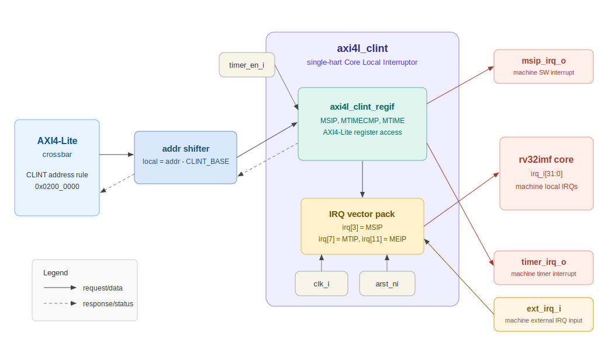

# AXI4-Lite CLINT

## Overview

`axi4l_clint` is the top-level AXI4-Lite Core Local Interruptor block for a single RISC-V hart. It wraps the CLINT register interface, accepts memory-mapped AXI4-Lite accesses, and drives local interrupt requests into the CPU interrupt vector.

In this SoC, CLINT should be connected as another AXI4-Lite slave behind the existing crossbar. It can use the currently unused master port slot that is reserved for I2C, or a new master port can be added to the crossbar configuration.

## Block Diagram



## Key Features

- AXI4-Lite memory-mapped CLINT peripheral
- Single-hart machine software interrupt support
- Single-hart machine timer interrupt support
- 64-bit timer compare and counter registers over a 32-bit bus
- Direct interrupt-vector outputs for `rv32imf`
- Optional external interrupt pass-through point for future PLIC or platform IRQ integration

## Suggested Address Map

| Region | Base | Size | Description |
| ------ | ---- | ---- | ----------- |
| CLINT | `0x0200_0000` | `0x0001_0000` | Single-hart CLINT register window |

The SoC package can define:

```systemverilog
localparam int CLINT_BASE = 32'h0200_0000;
localparam int CLINT_LEN  = 32'h0001_0000;
```

Then add a crossbar rule:

```systemverilog
'{idx: CLINT_PORT, start_addr: CLINT_BASE, end_addr: CLINT_BASE + CLINT_LEN - 1}
```

## Internal Register Map

The top-level CLINT forwards local offsets to `axi4l_clint_regif`.

| Offset | Name | Access | Description |
| ------ | ---- | ------ | ----------- |
| `0x0000` | `MSIP` | RW | Machine software interrupt pending |
| `0x4000` | `MTIMECMP_LO` | RW | Lower 32 bits of machine timer compare |
| `0x4004` | `MTIMECMP_HI` | RW | Upper 32 bits of machine timer compare |
| `0xBFF8` | `MTIME_LO` | RW | Lower 32 bits of machine timer |
| `0xBFFC` | `MTIME_HI` | RW | Upper 32 bits of machine timer |

## Top-Level Ports

### Global Signals

| Name | Direction | Width | Description |
| ---- | --------- | ----- | ----------- |
| `clk_i` | input | 1 | AXI/register clock |
| `arst_ni` | input | 1 | Asynchronous reset, active-low |
| `timer_en_i` | input | 1 | Enables `mtime` counting |

### AXI4-Lite Interface

| Name | Direction | Type | Description |
| ---- | --------- | ---- | ----------- |
| `axi4l_req_i` | input | `axil_req_t` | AXI4-Lite request from crossbar |
| `axi4l_resp_o` | output | `axil_resp_t` | AXI4-Lite response to crossbar |

### Interrupt Interface

| Name | Direction | Width | Description |
| ---- | --------- | ----- | ----------- |
| `irq_o` | output | 32 | Interrupt vector to CPU |
| `msip_irq_o` | output | 1 | Optional raw software interrupt output |
| `timer_irq_o` | output | 1 | Optional raw timer interrupt output |
| `ext_irq_i` | input | 1 | Optional machine external interrupt input |

## CPU Interrupt Vector Mapping

For `rv32imf`, drive the interrupt vector as:

```systemverilog
always_comb begin
  irq_o     = '0;
  irq_o[3]  = msip_irq;
  irq_o[7]  = timer_irq;
  irq_o[11] = ext_irq_i;
end
```

| Bit | Meaning |
| --- | ------- |
| `irq_o[3]` | Machine software interrupt, MSIP |
| `irq_o[7]` | Machine timer interrupt, MTIP |
| `irq_o[11]` | Machine external interrupt, MEIP |

## SoC Integration Steps

1. Add `clint_pkg.sv` for CLINT offsets and AXI-Lite typedefs.
2. Add `axi4l_clint_regif.sv` for the register implementation.
3. Add `axi4l_clint.sv` as the wrapper that exposes a SoC-level AXI4-Lite slave.
4. Add `CLINT_BASE`, `CLINT_LEN`, and a crossbar address rule in `sc_soc_pkg.sv`.
5. Instantiate CLINT in `sc_soc.sv`.
6. Connect `irq_o` to `rv32imf.irq_i`.
7. Add software definitions in `software/include/clint.h`.

## Software Access Example

```c
#define CLINT_BASE         0x02000000u
#define CLINT_MSIP         (*(volatile uint32_t *)(CLINT_BASE + 0x0000u))
#define CLINT_MTIMECMP_LO  (*(volatile uint32_t *)(CLINT_BASE + 0x4000u))
#define CLINT_MTIMECMP_HI  (*(volatile uint32_t *)(CLINT_BASE + 0x4004u))
#define CLINT_MTIME_LO     (*(volatile uint32_t *)(CLINT_BASE + 0xBFF8u))
#define CLINT_MTIME_HI     (*(volatile uint32_t *)(CLINT_BASE + 0xBFFCu))
```

## Verification Checklist

- AXI write/read of `MSIP`
- `MSIP[0]` assertion drives `irq_o[3]`
- `mtime` increments while `timer_en_i` is high
- `mtime >= mtimecmp` drives `irq_o[7]`
- Writing a future `mtimecmp` clears the timer interrupt
- Invalid register offsets return SLVERR
- Partial writes return SLVERR

