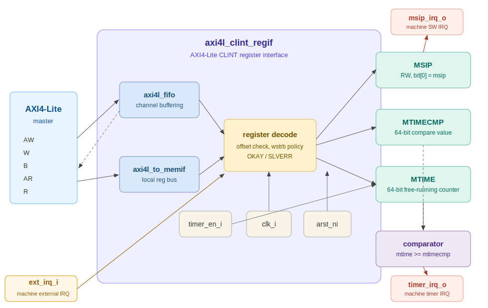

# AXI4-Lite CLINT Register Interface

## Overview

`axi4l_clint_regif` is the AXI4-Lite slave register interface for a RISC-V Core Local Interruptor (CLINT). It exposes machine software interrupt and machine timer registers to software and generates local interrupt requests for the CPU.

The register interface is intended to follow the same structure used by the existing AXI4-Lite register blocks in this repository:

- AXI4-Lite request/response bundles
- Optional channel decoupling through `axi4l_fifo`
- AXI4-Lite to local memory-style transaction conversion through `axi4l_to_memif`
- Word-aligned register decode
- Active-low asynchronous reset

## Block Diagram



## Key Features

- AXI4-Lite slave register interface
- 32-bit software interrupt pending register, `msip`
- 64-bit machine timer compare register, `mtimecmp`
- 64-bit machine timer counter, `mtime`
- Timer interrupt generated when `mtime >= mtimecmp`
- Machine software interrupt generated from `msip[0]`
- Full-word write policy for all writable registers
- SLVERR response for invalid offsets or unsupported byte strobes

## Parameters

| Name | Type | Default | Description |
| ---- | ---- | ------- | ----------- |
| `axil_req_t` | type | `logic` | AXI4-Lite request struct type |
| `axil_resp_t` | type | `logic` | AXI4-Lite response struct type |
| `ADDR_WIDTH` | int | 16 | Local CLINT address width. Must cover `0xBFFC` |
| `DATA_WIDTH` | int | 32 | AXI4-Lite data width |
| `MTIME_INC` | logic [63:0] | `64'd1` | Increment applied to `mtime` on each enabled timer tick |

## Ports

### Global Signals

| Name | Direction | Width | Description |
| ---- | --------- | ----- | ----------- |
| `clk_i` | input | 1 | Register interface clock |
| `arst_ni` | input | 1 | Asynchronous reset, active-low |
| `timer_en_i` | input | 1 | Enables `mtime` counting |

### AXI4-Lite Interface

| Name | Direction | Type | Description |
| ---- | --------- | ---- | ----------- |
| `req_i` | input | `axil_req_t` | AXI4-Lite request bundle |
| `resp_o` | output | `axil_resp_t` | AXI4-Lite response bundle |

### Interrupt Outputs

| Name | Direction | Width | Description |
| ---- | --------- | ----- | ----------- |
| `msip_irq_o` | output | 1 | Machine software interrupt request |
| `timer_irq_o` | output | 1 | Machine timer interrupt request |

### Optional Visibility Outputs

| Name | Direction | Width | Description |
| ---- | --------- | ----- | ----------- |
| `mtime_o` | output | 64 | Current timer count |
| `mtimecmp_o` | output | 64 | Current timer compare value |

## Register Map

The register map follows the common RISC-V CLINT layout for a single hart.

| Offset | Name | Access | Reset | Description |
| ------ | ---- | ------ | ----- | ----------- |
| `0x0000` | `MSIP` | RW | `0x0000_0000` | Software interrupt pending. Bit 0 drives `msip_irq_o` |
| `0x4000` | `MTIMECMP_LO` | RW | `0xFFFF_FFFF` | Lower 32 bits of `mtimecmp` |
| `0x4004` | `MTIMECMP_HI` | RW | `0xFFFF_FFFF` | Upper 32 bits of `mtimecmp` |
| `0xBFF8` | `MTIME_LO` | RW | `0x0000_0000` | Lower 32 bits of `mtime` |
| `0xBFFC` | `MTIME_HI` | RW | `0x0000_0000` | Upper 32 bits of `mtime` |

## Register Behavior

### MSIP

`MSIP[0]` is the software interrupt pending bit. When software writes `1` to this bit, the block asserts `msip_irq_o`. Writing `0` clears the request.

Reserved bits should read as zero and ignore writes.

### MTIMECMP

`MTIMECMP_LO` and `MTIMECMP_HI` form one 64-bit compare value. The timer interrupt is level-sensitive:

```systemverilog
timer_irq_o = (mtime_q >= mtimecmp_q);
```

Software should update the compare register carefully to avoid a temporary compare match. A common sequence is:

1. Write `MTIMECMP_HI` to `0xFFFF_FFFF`
2. Write `MTIMECMP_LO`
3. Write final `MTIMECMP_HI`

### MTIME

`mtime` is a 64-bit free-running counter. It increments when `timer_en_i` is high. Providing RW access allows firmware or tests to initialize the timer value directly.

## AXI4-Lite Access Policy

- Only 32-bit aligned register offsets are valid
- Writes require `wstrb == 4'b1111`
- Invalid read/write offsets return SLVERR
- Invalid reads return zero data with SLVERR
- Valid accesses return OKAY

## Interrupt Mapping

For the `rv32imf` core used in this repository, the CLINT outputs should be mapped into the 32-bit interrupt vector as:

| CLINT Output | Core IRQ Bit | RISC-V Interrupt |
| ------------ | ------------ | ---------------- |
| `msip_irq_o` | `irq_i[3]` | Machine software interrupt |
| `timer_irq_o` | `irq_i[7]` | Machine timer interrupt |

## Notes

- The local address width should be at least 16 bits because the highest CLINT register offset is `0xBFFC`.
- The wrapper should subtract `CLINT_BASE` before driving this register interface.
- If the SoC has a separate real-time clock, use that clock or a divided tick to drive `timer_en_i`.

